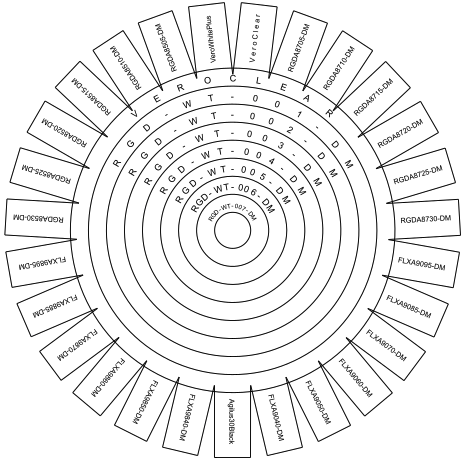

# Fusion360-SVG-Converter
Converting standard svg files to Fusion 360 importable svg files. 

## Why convert 
At current stage (July 2020), Fusion 360 does not fully support text rotation when importing svg files, yet [[roadmap](https://www.autodesk.com/products/fusion-360/blog/fusion-360-roadmap-update-2020/?_ga=2.35416929.1928432617.1595202244-638676889.1594269980#Sketching)]. For example, a svg file like this



would have an unexpected result when importing as a sketch like below.


## Why it happens
This is caused by the **transform** property in the svg file, in particular, the _rotate(a, cx, cy)_ method. 

1. By default, _cx=cy=0_, _i.e._, the text rotates by the center of the original point, while in Fusion 360, _cx_ and _cy_ are the left-bottom corner of the text by default. 
1. In addition, by default, _cx_ and _cy_ use absolute coordinates, while in Fusion 360, _cx_ and _cy_ use relative coordinates. 

## What this converter does
1. Find all _svg:text_ nodes.
1. Calculate the absolute coordinates after transformation [[stackoverflow](https://stackoverflow.com/questions/15133977/how-to-calculate-svg-transform-matrix-from-rotate-translate-scale-values)]. 
1. Replace _x_ and _y_ values with the calculated coordinates. 
1. Remove descendant nodes such as _svg:tspan_ under _svg:text_ nodes.

## Quick start
Download the _src/svg_to_fusion360.py_ file. 
```Python
from svg_to_fusion360 import SVGConverter

converter = SVGConverter()
converter.convert("path_to_your_input_folder/file_to_be_converted.svg", "path_to_your_output_folder/converted_file.svg")
```